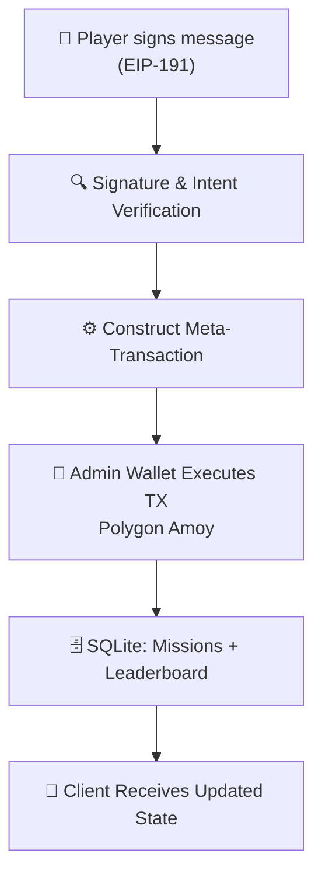

# CYBER RNG CORE ⚡  
### _Decentralized Backend for the CyberRNG Network_

```txt
  ______   ______  _____ ____    ____  _   _  ____    ____ ___  ____  _____ 
 / ___\ \ / / __ )| ____|  _ \  |  _ \| \ | |/ ___|  / ___/ _ \|  _ \| ____|
| |    \ V /|  _ \|  _| | |_) | | |_) |  \| | |  _  | |  | | | | |_) |  _|  
| |___  | | | |_) | |___|  _ <  |  _ <| |\  | |_| | | |__| |_| |  _ <| |___ 
 \____| |_| |____/|_____|_| \_\ |_| \_\_| \_|\____|  \____\___/|_| \_\_____|
   CYBER RNG CORE · TERMINAL MINING RPG · POLYGON AMOY · GASLESS META-TX
```

<div align="center">


### The Neural Backbone of the CyberRNG Network

<p>
  
  
  
  
  
</p>

<p>
  
  
  
</p>

</div>

---

## 📋 Table of Contents
- [📍 Overview](#-overview)
- [⚙️ Architecture](#️-architecture)
- [📦 Features](#-features)
- [🖥️ CLI Preview](#️-cli-preview)
- [🚀 Installation & Setup](#-installation--setup)
- [⛓️ Smart Contract Deployment](#️-smart-contract-deployment)
- [📡 API Endpoints](#-api-endpoints)
- [📊 Architecture Diagram](#-architecture-diagram)
- [🧪 Future Enhancements](#-future-enhancements)
- [📜 License](#-license)

---

## 📍 Overview

**CyberRNG Core** is the decentralized backend powering the **terminal-based mining RPG**.  
It functions as:

- **Gasless Relayer**
- **Game State Manager**
- **Meta-Transaction Executor**
- **Provably Fair RNG Engine**

The backend verifies signatures, executes blockchain actions on Polygon Amoy Testnet, and stores game data using SQLite.

> **Protocol Status:** ✔ ONLINE  
> **Network:** Polygon Amoy Testnet  
> **Relayer Fees:** 0 MATIC charged to users  

---

## ⚙️ Architecture

CyberRNG uses a hybrid **Web2 + Web3** architecture:

```mermaid
flowchart TD
    A[Player signs message (EIP-191)] --> B[Backend verifies signature]
    B --> C[Backend constructs meta-transaction]
    C --> D[Admin Wallet executes transaction on Polygon Amoy]
    D --> E[SQLite stores mission + leaderboard state]
    E --> F[Client receives updated game state]
```

---

## 📦 Features

### 🛡️ Gasless Gameplay  
No MATIC needed. Relayer handles fees.

### 🎲 Provably Fair RNG  
Uses Ethereum `prevrandao` entropy via smart contract.

### 🏭 Workshop System  
Crafting, enchanting, overclocking logic.

### 🖥️ Server Room (Staking)  
Generates passive income (APR defined on-chain).

### 📜 Shadow Contracts  
Daily quests generated server-side.

### 🏆 Leaderboard  
Tracks wealth & mining performance across all players.

---

## 🚀 Installation & Setup

### **Prerequisites**
- Node.js v18+
- NPM / Yarn

---

### **1. Clone the Repository**
```bash
git clone https://github.com/rafidef/cyber-rng.git
cd cyber-rng-core
```

---

### **2. Install Dependencies**
```bash
npm install
```

---

### **3. Configure Environment Variables**
Create `.env` in project root:

```ini
PORT=3000
POLYGON_AMOY_RPC="https://rpc-amoy.polygon.technology"

# Admin Wallet (must contain test MATIC)
PRIVATE_KEY="0x_YOUR_ADMIN_PRIVATE_KEY"

# Set after smart contract deployment
CONTRACT_ADDRESS=""
```

---

### **4. Run the Server**

**Development**
```bash
npx ts-node src/server.ts
```

**Production**
```bash
npm run build
npm start
```

---

## ⛓️ Smart Contract Deployment

Powered by **Hardhat Ignition**.

### **Compile Contracts**
```bash
npx hardhat compile
```

### **Deploy to Polygon Amoy**
```bash
npx hardhat ignition deploy ignition/modules/CyberSystem.ts --network amoy --reset
```

### **Update Config**
Copy deployed contract address → `.env`.

---

## 📡 API Endpoints

| Method | Endpoint | Description |
|--------|----------|-------------|
| POST | `/mine` | Execute RNG mining sequence |
| POST | `/equip` | Equip rig upgrades |
| POST | `/workshop/enchant` | Enhance item level |
| POST | `/rig/stake` | Stake an item for passive yield |
| POST | `/contracts/claim` | Claim daily mission rewards |
| GET | `/profile/:address` | Fetch user profile & rig |
| GET | `/leaderboard` | Global leaderboard |
| GET | `/contracts/:address` | Fetch mission list |

---

## 📊 Architecture Diagram



---

## 🧪 Future Enhancements

- 🧬 **VRF-based RNG (Chainlink Optional)**
- 🛰️ **Distributed Node Relayers**
- 🧿 **Zero-Knowledge Proof-based Actions**
- 🔐 **Hardware-bound sessions**

---

## 📜 License
MIT License — free for personal & commercial use.

---

<div align="center">
  <br><br>
  <sub>Built for the Shadows. Stay Anonymous.</sub>
</div>
